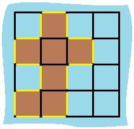

# Island Perimeter
You are given a map in form of a two-dimensional integer grid where 1 represents land and 0 represents water. Grid cells are connected horizontally/vertically (not diagonally). The grid is completely surrounded by water, and there is exactly one island (i.e., one or more connected land cells). The island doesn't have "lakes" (water inside that isn't connected to the water around the island). One cell is a square with side length 1. The grid is rectangular, width and height don't exceed 100. Determine the perimeter of the island.
## Example:
[[0,1,0,0],
 [1,1,1,0],
 [0,1,0,0],
 [1,1,0,0]]

Answer: 16
Explanation: The perimeter is the 16 yellow stripes in the image below:



## 解析
智商不够_(:зゝ∠)_碰见这种问题都没思路，然后去看了下讨论区的答案，发现大家做法差不多，没有什么特别方便的，目前有两种方法：

* 把每个格子的四条边都加上，减去重复计算的

```c++
class Solution {
public:
    int islandPerimeter(vector<vector<int>>& grid) {
        
         int count=0, repeat=0;
        for(int i=0;i<grid.size();i++)
        {
            for(int j=0; j<grid[i].size();j++)
                {
                    if(grid[i][j]==1)
                    {
                        count ++;
                        if(i!=0 && grid[i-1][j] == 1) repeat++;
                        if(j!=0 && grid[i][j-1] == 1) repeat++;
                    }
                }
        }
        return 4*count-repeat*2;
        
    }
};
```

因为一旦重合，就不会有边会被计算进去了，so需要减去`repeat*2`。感觉有点想血细胞计数板的方法...只计算左边和上边的重复。

* 对每条边进行分析，首先看左边的边，只有当左边的边处于第一个位置或者当前格子的左面没有岛格子的时候，左边的边计入周长。其他三条边的分析情况都跟左边的边相似，这里就不多叙述了。代码：

```c++
class Solution {
public:
    int islandPerimeter(vector<vector<int>>& grid) {
        if (grid.empty() || grid[0].empty()) return 0;
        int m = grid.size(), n = grid[0].size(), res = 0;
        for (int i = 0; i < m; ++i) {
            for (int j = 0; j < n; ++j) {
                if (grid[i][j] == 0) continue;
                if (j == 0 || grid[i][j - 1] == 0) ++res;
                if (i == 0 || grid[i - 1][j] == 0) ++res;
                if (j == n - 1 || grid[i][j + 1] == 0) ++res;
                if (i == m - 1 || grid[i + 1][j] == 0) ++res;
            }
        }
        return res;
    }
};
```

